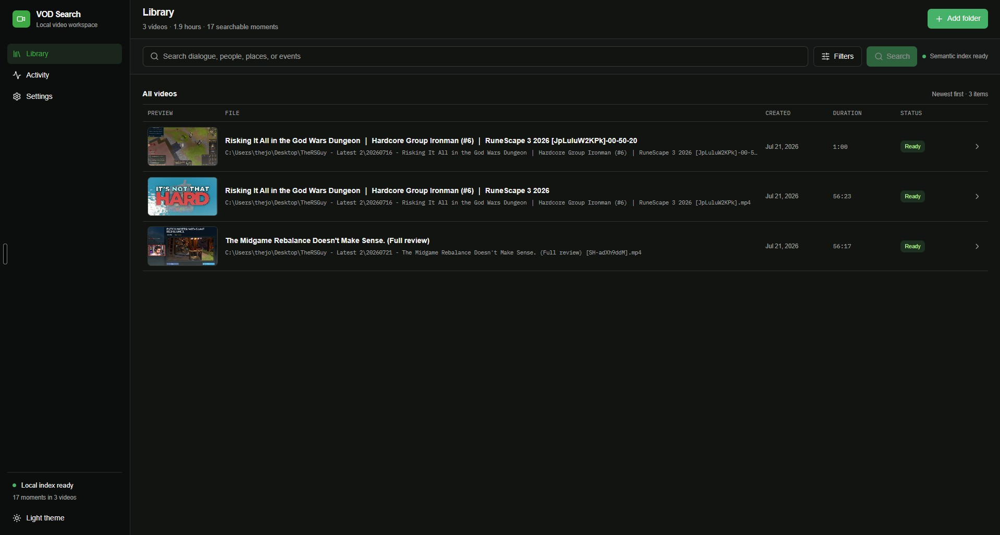
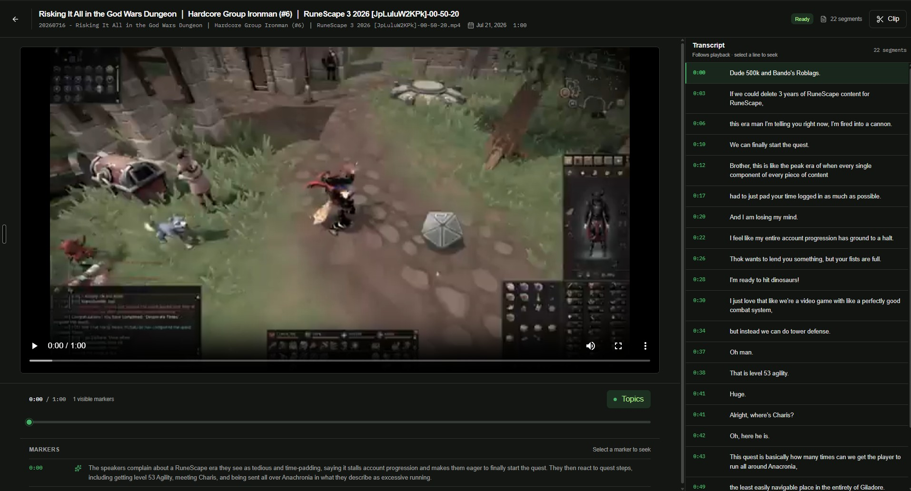

# VOD Search

VOD Search is a Windows-first video transcript search application. It indexes existing subtitles or local Whisper transcripts, identifies recurring speakers locally with bundled Sherpa ONNX models, asks Codex to enrich natural transcript topics, and combines full-text and semantic search.

Source videos are referenced in place and are never modified. Transcripts, tags,
speaker voice patterns, embeddings, and the search index stay under the application's local data folder.
Only untimed transcript text is sent to OpenAI when Codex creates summaries and
search metadata; video and audio files are never uploaded by VOD Search.

## Example screens

### Library



### Video workspace



## What works

- Recursively watches selected folders for common video and subtitle formats.
- Prefers SRT, VTT, ASS, or embedded captions before transcribing audio.
- Runs `whisper.cpp` locally with the free, open-source Whisper small.en model.
- Runs Sherpa ONNX locally with bundled segmentation and voice-embedding models to separate speakers, match recurring voices
  across clips, and annotate transcript lines with user-managed speaker names.
- Provides a Speakers review queue for finding every unassigned voice across the
  library, checking transcript evidence, and assigning or creating a speaker.
- Creates an initial local full-text index, then replaces its fixed windows with Codex-selected topic sections.
- Adds local BGE embeddings for meaning-based retrieval.
- Reuses portable transcript and topic bundles from a source folder's `.vod-search`
  directory, and can publish completed results there for other users of the same archive.
- Runs `codex exec` with the complete untimed transcript, a bundled topic-analysis
  skill, and a strict JSON schema to choose natural boundaries and create
  summaries, entities, events, aliases, and likely search phrases. Synopsis runs
  are pinned to `gpt-5.4-mini` with low reasoning effort for cost efficiency.
- Opens matching videos in a full-width player with timestamp markers plus
  transcript and summary tabs.
- Persists background jobs, resumes interrupted work, pauses on battery, and
  keeps moved-file identity through content fingerprints.
- Supports separate local-time processing windows for ingestion, Whisper
  transcription, and Codex summarization, including overnight ranges.
- Checks public GitHub Releases for newer packaged versions, downloads updates
  in the background, and offers to restart when an update is ready.

The enrichment model only sees transcript text. It cannot reliably describe a
purely visual event that nobody says aloud; computer-vision indexing is a later
extension.

## First run

1. Open **Settings** and install Codex, then select **Sign in** to authenticate
   with ChatGPT or an OpenAI account. If Codex is already installed, VOD Search
   detects it.
2. Open **Library** and use the first-run readiness panel to prepare Whisper
   small.en and the semantic search index. Both are downloaded and managed
   inside the app.
3. Add one or more folders. Compatible shared metadata is reused automatically;
   optionally enable **Contribute results to this folder** to share completed
   transcripts and summaries with other users of the same archive.
4. Search for spoken words, names, or descriptions such as “death to Kalphite
   King,” then open a result at its timestamp.

The Whisper, BGE, and speaker-model downloads are pinned and SHA-256 verified.
Whisper is about 465 MB, BGE is about 128 MB, and the bundled speaker models add
about 33 MB. No local generative model is downloaded and speaker recognition
does not require an account. Basic full-text search only requires Whisper (or existing subtitles); BGE supplies semantic
similarity, while Codex supplies richer summaries and event metadata.

The packaged Windows application includes Electron, FFmpeg, `whisper.cpp`, the
Sherpa ONNX native runtime, and its speaker models. End users do not need Node.js,
Python, pnpm, a separate AI account, or a terminal. The Settings page
uses OpenAI's official standalone Windows installer for Codex, which downloads
checksum-verified release assets into Codex's standard per-user storage and
places the app-managed command under the VOD Search application-data folder.

## Processing schedule

Under **Settings → Processing schedule**, ingestion, local speech processing, and
AI summaries can each run at any time or inside a daily local-time window.
Overnight ranges such as 10:00 PM–7:00 AM are supported. Work that has not
started remains queued outside its window; a job already running is allowed to
finish safely. **Rescan now** remains an explicit override for a source folder.
Lightweight local embedding work is not delayed, so completed summaries become
searchable without waiting for another window.

## Shared folder metadata

Every source folder can act as a portable metadata cache. VOD Search always
looks for a matching `.vod-search/<video-fingerprint>.json` bundle before it
queues transcription or Codex summarization. A bundle contains timed transcript
segments, topic boundaries, summaries, entities, events, aliases, and search
phrases. It never contains the video, absolute local paths, credentials, voice
patterns, speaker labels, or device-specific vector embeddings.

Publishing is opt-in per source folder under **Settings → Source folders**.
Files are written atomically and identified by a content fingerprint, so the
same video can be renamed or mounted at a different path on another computer.
Imported JSON is schema-validated and must match the local video's fingerprint
and size. BGE embeddings are rebuilt locally from imported topics because they
are small, fast to generate, and model-version specific.

## Development

Install the pinned package manager once if `pnpm` is not already available:

```bash
npm install --global pnpm@11.15.1
```

```bash
pnpm install
pnpm prepare:runtimes:win
pnpm dev
```

Run validation with:

```bash
pnpm typecheck
pnpm test
pnpm build
```

The bundled Windows runtimes are checksum-pinned builds of FFmpeg,
`whisper.cpp`, and the Sherpa segmentation and speaker-embedding models. They are downloaded into an ignored `resources/runtime/windows`
directory. Developers can override them with `VOD_SEARCH_FFMPEG_PATH`,
`VOD_SEARCH_FFPROBE_PATH`, `VOD_SEARCH_WHISPER_PATH`, and
`VOD_SEARCH_CODEX_PATH`. Speaker development can also use
`VOD_SEARCH_SHERPA_SEGMENTATION_MODEL_PATH` and
`VOD_SEARCH_SHERPA_EMBEDDING_MODEL_PATH`.

## Windows installer

Run this on Windows:

```bash
pnpm package:win
```

The NSIS installer is written to `release/`. Native Electron modules must be
rebuilt on Windows, so cross-packaging from Linux is intentionally unsupported.
The included `Windows installer` GitHub Actions workflow builds and uploads the
installer artifact on a Windows runner. Local packaging never publishes a
release.

Installed copies check for updates about 15 seconds after launch and every four
hours while running. Updates come from the public
`TheJoshJ/vod-search` GitHub Releases feed, download in the background, and are
installed after the user chooses **Restart now** or next closes the app.

To publish an update:

1. Change `version` in `apps/desktop/package.json`, for example to `0.1.1`.
2. Commit and push that version change to `main`.
3. Create and push a matching tag:

   ```bash
   git tag v0.1.1
   git push origin v0.1.1
   ```

The tag workflow requires the tag and desktop package version to match. It
creates a public GitHub Release containing the installer, blockmap, and
`latest.yml` update manifest. End users do not need a GitHub token. Windows code
signing is strongly recommended before distributing the installer broadly to
reduce SmartScreen warnings and strengthen publisher verification.

## Architecture

- `apps/desktop`: Electron main process, sandboxed preload, React UI, utility
  indexer process, filesystem watcher, and durable job scheduler.
- `packages/database`: SQLite schema, FTS5/`sqlite-vec`, and repositories.
- `packages/search`: subtitle parsing, chunking, lexical/semantic rank fusion.
- `packages/inference`: verified models, FFmpeg/Whisper adapters, local BGE,
  native Sherpa ONNX diarization, and the schema-validated Codex
  enrichment client and skill.
- `packages/contracts`: validated domain and IPC contracts shared by processes.
